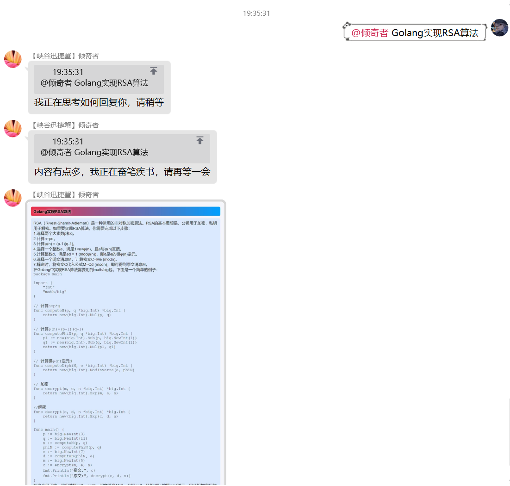

# 云崽qq机器人的chatgpt插件

* 支持单人连续对话Conversation
* API模式下，使用 GPT-3 API及相关模型配置尽可能逼近ChatGPT体验，支持自定义部分模型参数 ~~使用`text-chat-davinci-002-sh-alpha-aoruigiofdj83`模型，原汁原味ChatGPT体验(20230211只存活了五分钟)~~
* 支持问答图片截图
* 仅需OpenAI Api Key，开箱即用
* 提供基于浏览器的解决方案作为备选，有条件且希望得到更好回答质量可以选择使用浏览器模式。

## 版本要求
Node.js >= 18 / Node.js >= 14(with node-fetch)

## 安装
首先判断自己需要使用哪种模式，本插件支持官方API、第三方API和浏览器两种模式。也可以选择**我全都要**，通过qq发送命令`#chatgpt切换浏览器/API/API2`实时切换。对于轻量用户可以先使用API模式，有较高要求再转为使用其他模式。

> API模式和浏览器模式如何选择？
>
> * API模式会调用OpenAI官方提供的GPT-3 LLM API，只需要提供API Key。一般情况下，该种方式响应速度更快，可配置项多，且不会像chatGPT官网一样总出现不可用的现象，但其聊天效果明显较官网差。但注意GPT-3的API调用是收费的，新用户有18美元试用金可用于支付，价格为`$0.0200/ 1K tokens`.(问题和回答加起来算token)
> * API2模式会调用第三方提供的基于OpenAI text-davinci-002-render模型（官网同款）的API，需要提供ChatGPT的Token。效果比单纯的GPT-3 API好很多，但同时将Token提供给了第三方API，其中风险自行承担。
> * 浏览器模式通过在本地启动Chrome等浏览器模拟用户访问ChatGPT网站，使得获得和官方以及API2模式一模一样的回复质量，同时保证安全性。缺点是本方法对环境要求较高，需要提供桌面环境和一个可用的代理（能够访问ChatGPT的IP地址），且响应速度不如API，而且高峰期容易无法使用。

1. 进入 Yunzai根目录
2. 检查 Node.js 版本

```
node -v
```
若 Node.js >= 18，根据下方步骤安装即可。否则参考[这里](LowerNode.md)

1. 进入 Yunzai根目录
2. 安装依赖

```
pnpm install -w undici chatgpt showdown mathjax-node delay uuid remark strip-markdown random puppeteer-extra-plugin-recaptcha puppeteer-extra puppeteer-extra-plugin-stealth @waylaidwanderer/chatgpt-api keyv-file
```

**若使用API模式，chatgpt的版本号注意要大于4.2.0**

若不使用浏览器模式，可以不安装`random puppeteer-extra-plugin-recaptcha puppeteer-extra puppeteer-extra-plugin-stealth`这几个依赖，这几个依赖仅用于模拟浏览器登录。

3. 克隆项目
```
git clone https://github.com/ikechan8370/chatgpt-plugin.git ./plugins/chatgpt-plugin
```
4. 修改配置

编辑`plugins/chatgpt-plugin/config/index.js`文件，根据其中的注释修改必要配置项。

---

## 使用

### 基本使用
根据配置文件中的toggleMode决定联通方式。
* at模式：@机器人 发送聊内容即可
* prefix模式：【#chat+问题】，本模式可以避免指令冲突。


发挥你的想象力吧！

关于API及API1模式下配置中的一些模型的配置项：
* `model`：通常保持空即可，除非你想调用特定的模型，比如你用gpt-3微调的学到特定领域知识的机器人。API1模式下将强制使用chatGPT模型。

* `promptPrefixOverride`：通常保持空即可。如果你想调整机器人回复的风格，可以在这里加入对机器人的一些暗示，比如要求用中文，要求回答长一点/短一点。甚至可以让它有自己的小脾气。下图为我让他不要回答太简单的问题，并且表现出不耐烦。


* `assistantLabel`：默认为ChatGPT，表示机器人认知中的自己的名字。你可以修改为其他名字。

* `plus`：如果你购买了ChatGPT Plus，将这个值改为true可以使响应速度更快。

### 获取帮助
发送#chatgpt帮助

## TODO
* 更灵活的Conversation管理
* 支持Bing版本
* 版本号和归档
* API2模式下自动获取/刷新Token

## 关于openai账号
1. 注册openai账号
进入https://chat.openai.com/ ，选择signup注册。目前openai不对包括俄罗斯、乌克兰、伊朗、中国等国家和地区提供服务，所以自行寻找办法使用其他国家和地区的ip登录。此外，注册可能需要验证所在国家和地区的手机号码，如果没有国外手机号可以试试解码网站，收费的推荐https://sms-activate.org/。
2. 获取API key
进入账户后台创建API key：https://platform.openai.com/account/api-keys
3. 获取Access Token
登录后访问https://chat.openai.com/api/auth/session

其他问题可以参考使用的api库 https://github.com/transitive-bullshit/chatgpt-api 以及 https://github.com/waylaidwanderer/node-chatgpt-api

## 其他

### 关于未来更新

OpenAI 即将开放其官方ChatGPT API，且微软必应也公开发布了基于ChatGPT的问答搜索，能够为实现更好、更快的聊天机器人提供更多途径。

### 常见问题

1. 如果在linux系统上发现图片模式下emoj无法正常显示，可以搜索安装支持emoj的字体，如Ubuntu可以使用`sudo apt install fonts-noto-color-emoji`

2. linux云服务器可以安装窗口管理器和vnc创建并访问虚拟桌面环境。

  > 以ubuntu为例给出一个可行的方案：
  >
  > 1. 安装xvfb和fluxbox
  >    `sudo apt-get install x11vnc xvfb fluxbox`
  > 2. 启动桌面环境。建议用tmux或screen等使其能够后台运行。注意本命令使用默认5900端口和无密码，注意通过防火墙等保护。
  >    `x11vnc -create -env FD_PROG=/usr/bin/fluxbox -env X11VNC_FINDDISPLAY_ALWAYS_FAILS=1   -env X11VNC_CREATE_GEOM=${1:-1024x768x16}   -nopw -forever`
  > 3. 使用vnc客户端连接至云桌面，右键Applications > Shells > Bash打开终端，然后进入Yunzai目录下运行node app即可。
  >
  > 实测该方案资源占用低，运行稳定，基本1核2G的轻量云服务器就足够了。

3. 我和机器人聊天但没有任何反应怎么办？
可能是由于Yunzai-bot异常退出等原因造成Redis 队列中有残留的等待问题。使用`#清空队列`命令清除队列后再试。

4.  Error [ERR_MODULE_NOT_FOUND]: Cannot find package 'xxx'.
请参照本文档前面的安装依赖部分重新依赖。随着项目更新可能引入新的依赖。

## 感谢
* https://github.com/transitive-bullshit/chatgpt-api
* https://github.com/waylaidwanderer/node-chatgpt-api
* https://chat.openai.com/

## 由于issue实在较多且大多重复，建了个QQ群，欢迎各位小白大佬来玩


